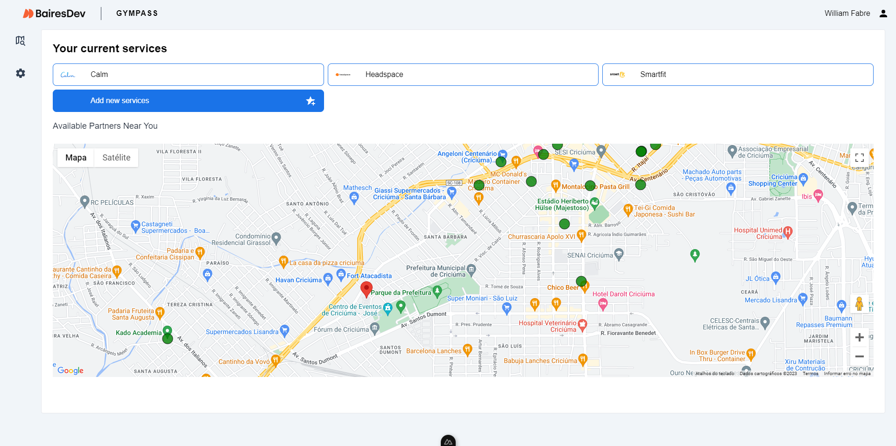
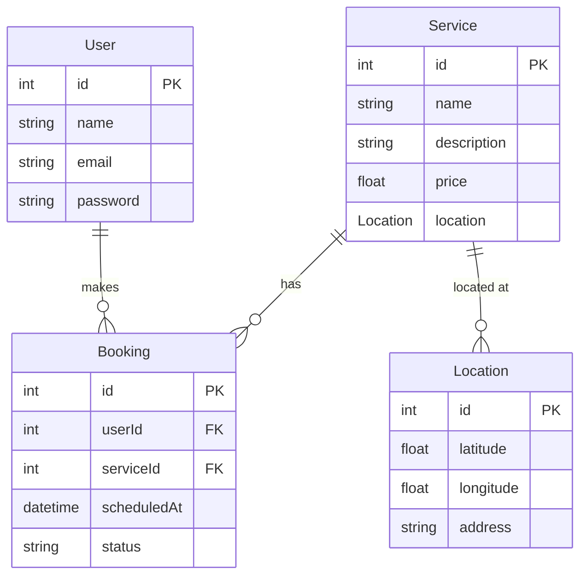

# Gympass

A Health software to integrate the employees with health companies and solutions free of charge offered by the company

This is a rethink project made in Nuxt3 with Vue and Typescript

## Summary

- [Setup](#setup)
  - [Development Server](#setup-dev)
  - [Production](#setup-prod)
- [Application Proccess](#process)
  - [User Flow](#process-user)
  - [Partner Flow](#process-partner)
  - [Backend Flow](#process-backend)
- [Libraries](#libraries)
- [To-DO](#todo)

## Setup

<div id="setup"></div>

Make sure to install the dependencies:

```bash
# npm
npm install
```

### Development Server

<div id="setup-dev"></div>

Start the development server on `http://localhost:3000`:

```bash
# npm
npm run dev
```

### Production

<div id="setup-prod"></div>

Build the application for production:

```bash
# npm
npm run build
```

Locally preview production build:

```bash
# npm
npm run preview
```

Check out the [deployment documentation](https://nuxt.com/docs/getting-started/deployment) for more information.

## Application Process



## Application Process

<div id="process"></div>

### User Flow

<div id="process-user"></div>

- **Registration and Login:** Outline how users can register and log into the app.
- **Plan Selection:** Describe the process of choosing different subscription plans.
- **Finding Locations:** Detail how users can find and select gyms, studios, or personal trainers near them.
- **Activity Booking:** Explain how users can book classes or sessions through the app.
- **Tracking Usage:** Discuss features for users to track their activity and usage history.

### Partner Flow

<div id="process-partner"></div>

- **Partner Registration:** Explain how partners can sign up and list their services.
- **Offer Management:** Describe how partners can manage their schedules, services, and user bookings.
- **Analytics and Reporting:** Provide information on the tools available for partners to track user visits and revenue.

### Backend Functionality

<div id="process-backend"></div>

- **Data Management:** Detail how the backend handles user data, partner listings, and bookings.
- **Integration:** Discuss integration with third-party services, if any.
- **Security and Compliance:** Highlight the security measures and compliance standards followed by the app.

## Libraries

<div id="libraries"></div>

This project utilizes several key libraries and frameworks to enhance its functionality and performance. Below is a brief overview of each, along with their role in the application:

- **Nuxt3** Nuxt3 is used for structuring the application, routing, and server-side rendering, ensuring a fast and SEO-friendly user experience.
- **Tailwind CSS** This project uses Tailwind CSS for styling components, ensuring a consistent and responsive design across all pages and components.
- **TypeScript** is used throughout the project to write safer and more predictable code, reducing the likelihood of runtime errors.
- **Vue 3** powers the project's user interface, leveraging its reactivity system and component-based architecture to create dynamic and engaging user experiences.
- **Pinia** For Handle State management.

## Database Mapping



## To-Do List

<div id="todo"></div>

This to-do list outlines the key tasks required to develop the backend and customer flow for the application, focusing on map interaction and service scheduling.

### Backend Development

- [ ] **Set Up Backend Environment:**

  - [ ] Initialize the backend project with the NestJS and a Boilerplate from [Awesome NestJS](https://github.com/nartc/awesome-nest).
  - [ ] Configure essential libraries and middleware.
  - [ ] Create Map Suggestion Route (First System Route)

- [ ] **Database Design:**

  - [ ] Design and implement the database schema.
  - [ ] Ensure relationships between users, services, and bookings are well-defined.
  - [ ] Implement the ORM and Seeds

- [ ] **API Development:**

  - [ ] Develop and integrate partners CRUD.
  - [ ] Develop and integrate Booking CRUD.
  - [ ] Creating the tests cycle for this CRUD's

- [ ] **Testing and Debugging:**
  - [ ] Write unit tests for backend APIs.
  - [ ] Write integration tests for backend APIs.
  - [ ] Coverage of 70%

### Customer Flow Development

- [ ] **Map Interface Implementation:**

  - [x] Implement functionality to display markers for gyms and studios on the map.
  - [ ] Implement a functionality to click on markers to open the scheduling and signature details
  - [ ] Integrate with backend to validate if is a valid partner and only show then

- [ ] **Service Listing and Details:**

  - [ ] Create components to list services by user.
  - [ ] Create a template to check info about the signed service
  - [ ] Create Atomicity to reuse this component for scheduling a service

- [ ] **Scheduling and Sign System:**
  - [ ] Develop a system to user see how much of discount they can have and to schedule and sign some services and gym's
  - [ ] Create a Schedule calendar to user see which times is the most popular
  - [ ] Integrate with backend.

4. **User Authentication and Profile Management:**
   - [ ] Set up user authentication and profile management in the frontend 0Auth.
   - [ ] Create a Gate System
   - [ ] Handle this with Pinia instead of just use a local storage
